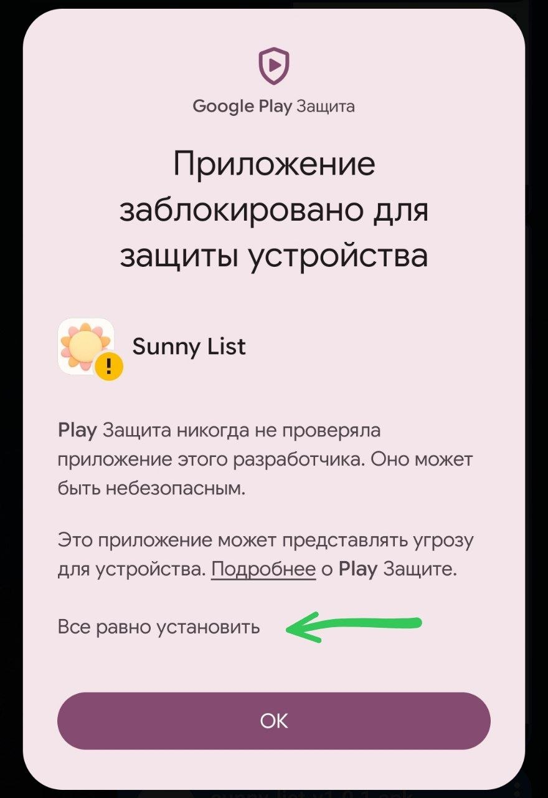
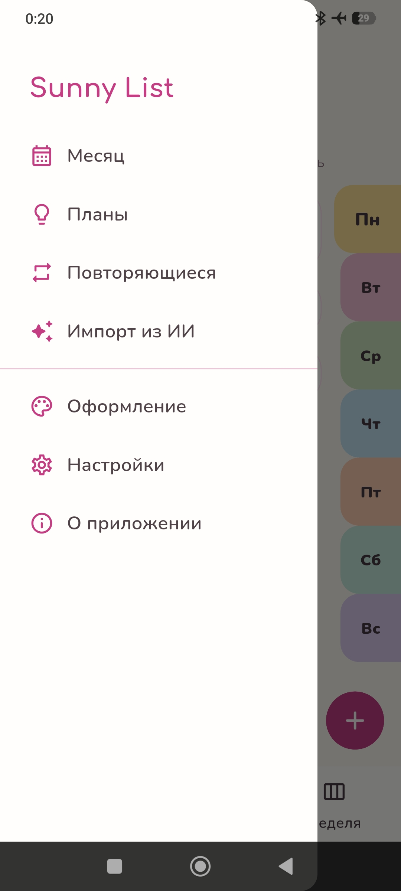
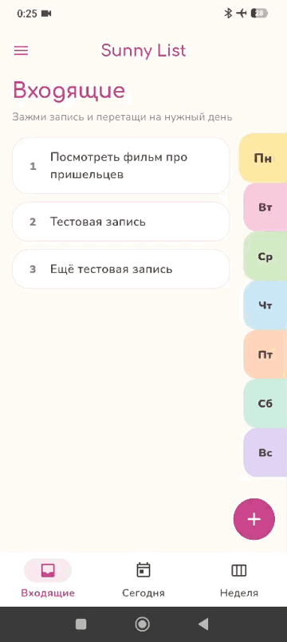
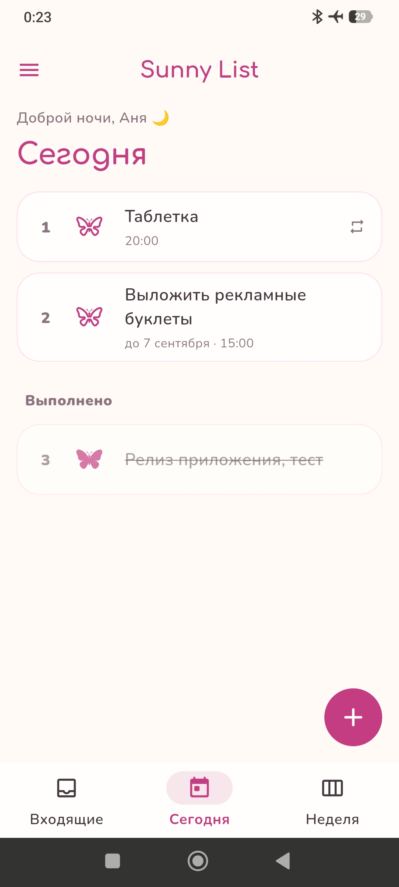
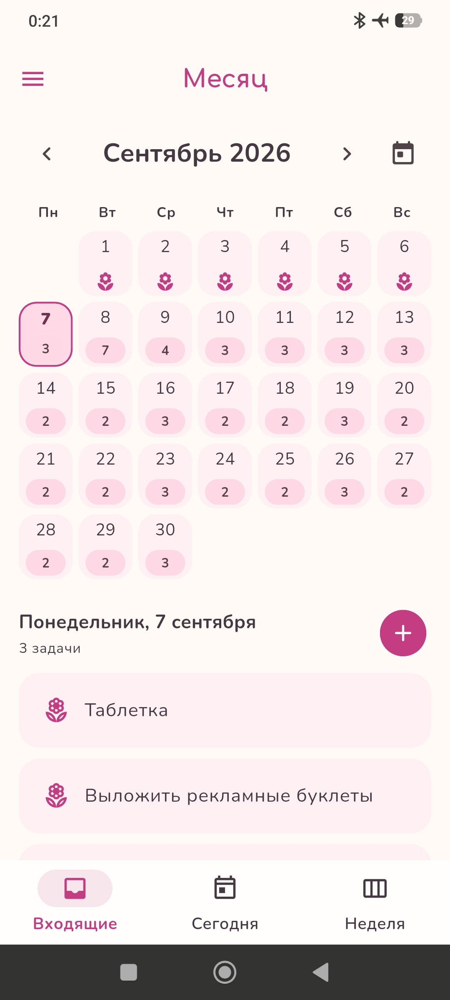
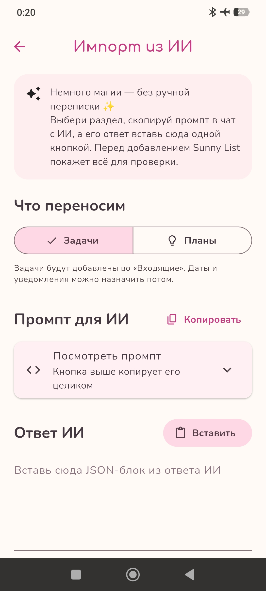
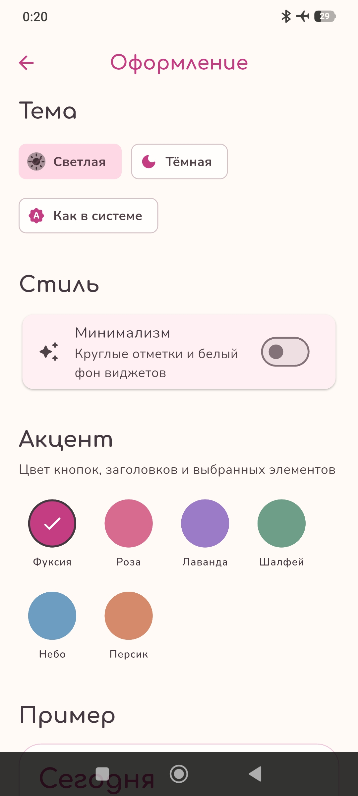

# Sunny List ☀️

  <a href="https://github.com/Anny-cloudy/Sunny-List/releases/latest"><strong>⬇️ Скачать последнюю версию</strong></a>

  

  Уютный планировщик задач для Android. 
  Бесплатно и без рекламы.

Sunny List помогает разложить дела по дням, не потерять повторяющиеся задачи и сохранить планы на потом. Ниже — подробная инструкция: что можно нажимать, куда свайпать и как переносить записи.

## Установка

1. Открой раздел **Releases** справа на странице репозитория.
2. Выбери последнюю версию и скачай файл `sunny-list-v…apk`.
3. Открой APK на телефоне.
4. Если Android попросит разрешение, разреши установку приложений из выбранного браузера или файлового менеджера.
5. Если появится предупреждение Google Play Защиты, нажми **«Всё равно установить»**, как показано ниже.
6. Подтверди установку Sunny List.

  

При обновлении скачай новый APK и установи его поверх предыдущей версии. Перед обновлением можно создать резервную копию в настройках.

> Android предупреждает о приложениях, установленных не из Google Play. Это нормально для APK с GitHub. Загружай Sunny List только из Releases этого репозитория.

## Быстрый старт

- Круглая кнопка **+** создаёт новую задачу или запись в открытом разделе.
- Нажатие на контурную бабочку отмечает задачу выполненной.
- Нажатие на закрашенную бабочку возвращает выполненную задачу.
- **Двойное нажатие по карточке** открывает редактирование.
- **Долгое нажатие и перетаскивание** меняет порядок задач в списке.
- **Долгое нажатие и перетаскивание на день недели** во «Входящих» переносит задачу на выбранный день.
- **Свайп влево** возвращает задачу во «Входящие». Для планов такой свайп создаёт копию во «Входящих», не удаляя сам план.

## Навигация

Внизу находятся основные разделы **«Входящие»**, **«Сегодня»** и **«Неделя»**. Остальные возможности открываются через боковое меню: месяц, планы, повторы, импорт из ИИ, оформление, настройки и информация о приложении.

  

## «Входящие»: быстро записать и распределить

Во «Входящие» удобно складывать всё, для чего дата пока не выбрана.

1. Нажми **+** и введи название задачи.
2. Чтобы назначить день, зажми карточку и перетащи её на ярлычок **Пн–Вс** справа.
3. Текущий день выделен более широким ярлычком. Дни выше него относятся уже к следующей неделе, а сам текущий день и дни ниже — к этой.
4. Чтобы изменить текст, дату, время или напоминание, дважды нажми по карточке.

  

## «Сегодня»: выполнение, редактирование и порядок

- Нажми на бабочку, чтобы выполнить задачу. Она переместится в раздел **«Выполнено»**.
- Нажми на закрашенную бабочку, чтобы вернуть её обратно.
- Дважды нажми по карточке, чтобы открыть редактирование.
- Зажми карточку и перетащи выше или ниже, чтобы изменить порядок задач.
- Проведи карточку **справа налево**, чтобы убрать дату и вернуть задачу во «Входящие».

  

  

## «Неделя»: дела по дням

Экран недели показывает задачи с понедельника по воскресенье. При открытии он фокусируется на сегодняшнем дне. Если со вчера остались незавершённые задачи, сначала будет показан вчерашний день.

- Бабочка отмечает задачу выполненной или возвращает её.
- Двойное нажатие по карточке открывает редактирование.
- Долгое нажатие позволяет изменить порядок задач внутри дня.
- Свайп справа налево возвращает задачу во «Входящие».
- Если остались задачи со вчера, их можно перенести на сегодня кнопкой **«Перенести»**.

## «Месяц»: обзор и выбранный день

В календаре видно количество задач на каждую дату. Нажми на нужный день — его задачи появятся под календарём.

- Цветок отмечает задачу выполненной.
- Двойное нажатие по карточке задачи открывает редактирование.
- Стрелки переключают месяцы.

  

## Повторяющиеся задачи

В разделе **«Повторяющиеся»** можно настроить дело на выбранные дни недели, указать период, время и напоминание.

- Нажми **+**, чтобы создать повтор.
- Дважды нажми по существующей карточке, чтобы изменить правило.
- В окне редактирования можно удалить текущую запись или весь повтор целиком. Прошлые и уже выполненные задачи при этом сохраняются в истории.

## Планы

Планы подходят для идей без обязательной даты. Их можно распределять по собственным категориям.

- Нажми на бабочку, чтобы выполнить или вернуть план.
- Дважды нажми по карточке, чтобы отредактировать её.
- Проведи карточку справа налево, чтобы создать из плана задачу во «Входящих». Сам план останется на месте.

## Импорт из беседы с ИИ

Если обсуждаешь планы с ИИ, их можно перенести в приложение. Sunny List даёт готовый промпт для отправки в чат и проверяет ответ выбранного тобой помощника перед импортом.

1. Открой **Меню → Импорт из ИИ**.
2. Выбери **«Задачи»** или **«Планы»**.
3. Нажми **«Копировать»** рядом с промптом.
4. Вставь промпт в беседу с ИИ.
5. Скопируй полученный JSON-блок.
6. Вернись в Sunny List и нажми **«Вставить»**.
7. Нажми **«Импортировать»** и проверь подготовленный список перед добавлением.

Повреждённый или неподходящий JSON не добавляется частично: сначала Sunny List проверяет ответ целиком.

  

## Оформление

В разделе **«Оформление»** можно выбрать светлую, тёмную или системную тему, изменить основной цвет и включить минимализм.

В минималистичном режиме бабочки и цветы заменяются круглыми отметками, а фон виджетов становится белым. Выбранный акцентный цвет используется и в виджетах.

  

## Виджеты

Sunny List добавляет два виджета на домашний экран Android.

### Задачи на сегодня

- показывает количество невыполненных задач и первые шесть записей;
- нажатие на бабочку выполняет задачу прямо с виджета;
- нажатие на фон или название открывает Sunny List;
- в полночь список переключается на новый день.

### Календарь

- показывает текущий месяц и выделяет сегодняшнюю дату;
- обновляется в полночь, при изменении системной даты или часового пояса;
- двойное нажатие по календарю принудительно перечитывает текущую дату.

  

## Напоминания

Для задачи или повтора можно выбрать дату, время и уведомление. В настройках доступны мелодия, громкость Sunny List и вибрация. На Android 13 и новее при первом запуске потребуется разрешить уведомления.

## Приватность и данные

Sunny List работает без регистрации и облачной синхронизации. Имя пользователя, задачи, планы, повторяющиеся записи и настройки хранятся локально на устройстве и не отправляются разработчику или сторонним сервисам. В приложении нет рекламы и аналитики.

- Резервная копия создаётся только по команде пользователя и сохраняется в выбранный им файл.
- Импорт из ИИ выполняется вручную: Sunny List ничего не отправляет в чат самостоятельно. Если пользователь вставляет сведения во внешний ИИ-сервис, к ним применяются правила приватности этого сервиса.
- Ссылки на страницу обновлений и поддержку проекта открываются во внешнем браузере.

Перед удалением приложения обязательно создай резервную копию: без неё локальные данные могут быть потеряны.

## Резервная копия

Открой **Настройки → Данные**:

- **Создать резервную копию** сохраняет задачи, повторы, планы и поддерживаемые настройки в файл `.sunnybackup`;
- **Восстановить из копии** сначала проверяет файл, затем после подтверждения заменяет текущие данные сохранёнными.

Храни резервную копию в надёжном месте. Встроенные мелодии в файл не добавляются — они уже находятся в приложении.

## Обратная связь

На GitHub есть раздел **Issues** — через него можно сообщить об ошибке или предложить идею. Если у тебя есть аккаунт GitHub и такой способ удобен, создай новое обращение и укажи:

- модель телефона;
- версию Android;
- что было сделано перед ошибкой;
- повторяется ли ошибка после перезапуска приложения.

После публикации репозитория обращения и комментарии будут видны всем. Проверяй прикладываемые скриншоты, чтобы на них не осталось личных задач или уведомлений.

Если GitHub непривычен — ничего страшного. Более простой способ обратной связи будет добавлен позже.

## Поддержать проект

Sunny List останется бесплатным и без рекламы. Если приложение оказалось полезным, проект можно [поддержать добровольно](https://dalink.to/anny_cloudy).

## Автор

**Anny Cloudy**

Исходный код приложения в этом репозитории не публикуется. Репозиторий предназначен для установочных APK, инструкций, скриншотов и описаний выпусков.
